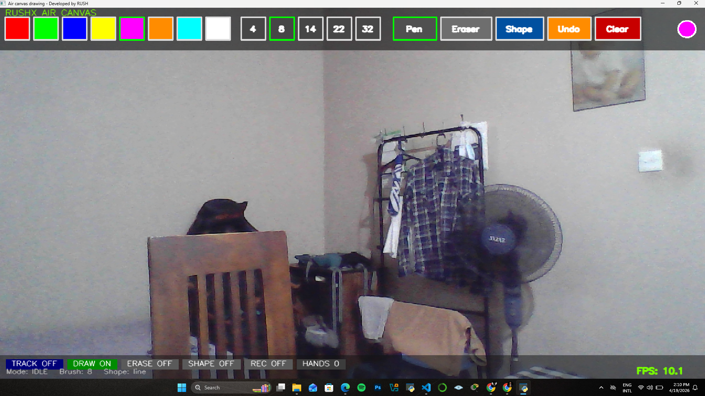

# Air Canvas - Version 1.0 |Developed by RUSH 🎨🖐️
<p align="center">
  
  
  
  
</p>

An intelligent **air canvas drawing application** built with **Python**, **OpenCV**, and **MediaPipe**.  
This project allows users to control a virtual pointer and draw shapes in the air using hand gestures captured from a webcam.

---

## 📌 Overview

**Air Canvas pro** is a real-time computer vision project that detects hand landmarks and interprets gestures to perform drawing actions, tool switching, color selection, erasing, undo, clearing, saving, and shape drawing on a virtual canvas.

It is designed as an interactive and touchless drawing system suitable for creative demonstrations, presentations, and gesture-based UI experimentation.

---

## ✨ Features

- Real-time hand detection using **MediaPipe**
- Gesture-based drawing on a virtual canvas
- Multiple color selection
- Adjustable brush sizes
- Pen and eraser modes
- Shape drawing mode
- Undo last stroke
- Clear canvas
- Save final artwork
- FPS display for performance monitoring
- On-screen toolbar UI
- Cross-platform Python implementation

---

## 🛠️ Tech Stack

- **Python**
- **OpenCV**
- **MediaPipe**
- **NumPy**
- **PIL / Pillow** (if used)
- **Git & GitHub**

---

## 📷 Demo Preview

> record_20260419_111038.avi



---

## 📁 Project Structure

```bash
virtual-pointer-pro/
├── main.py
├── requirements.txt
├── README.md
├── .gitignore
├── assets/
│   ├── screenshot.png
│   └── demo.gif
└── ...